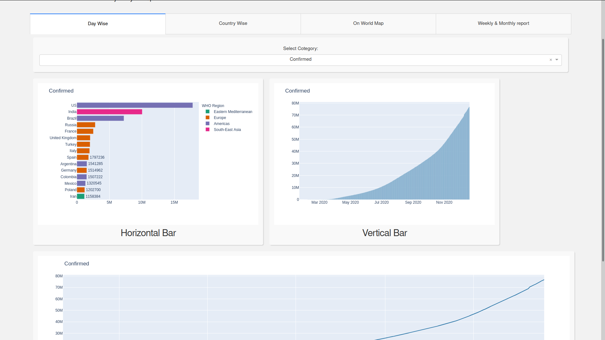
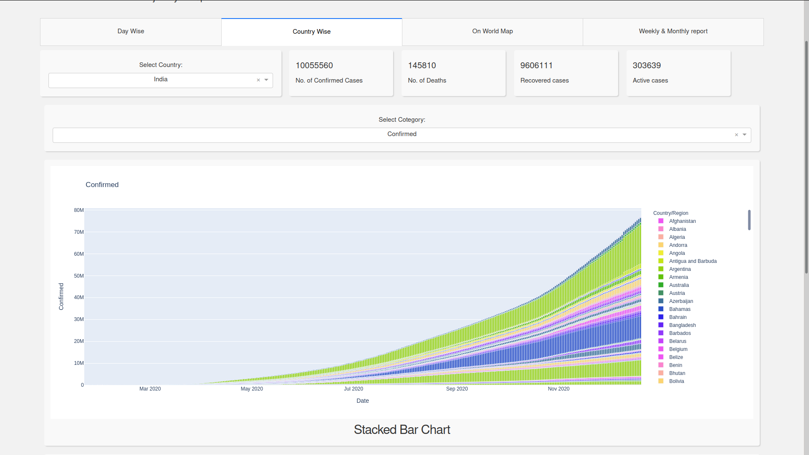
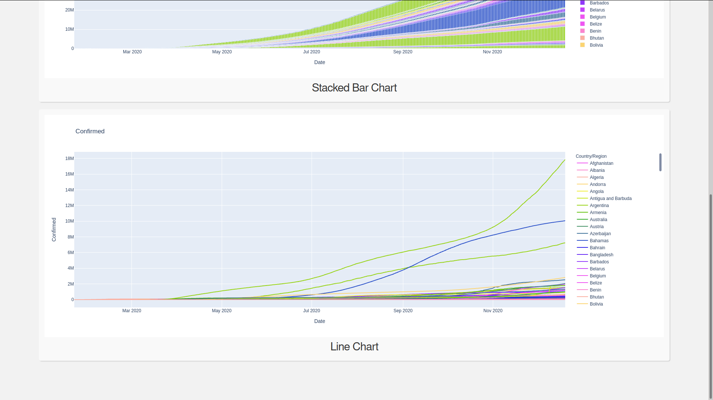
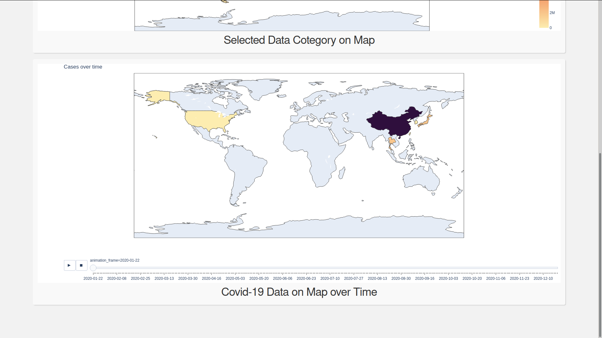
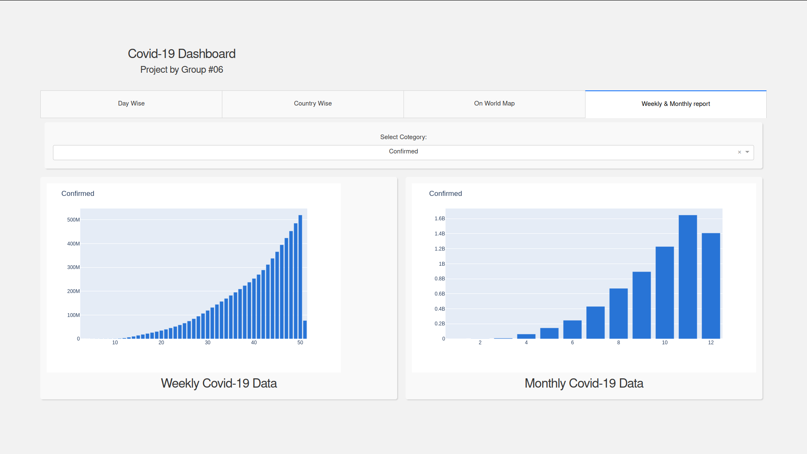

# Covid-19 Dashboard with plotly-dash in Python

### Running the app locally

First create a virtual environment with conda or venv inside a temp folder, then activate it.

```
virtualenv venv

# Windows
venv\Scripts\activate
# Or Linux
source venv/bin/activate

```

Clone the git repo, then install the requirements with pip

```

git clone <link to this repo>
cd <to this repo>
pip install -r requirements.txt

```

Run the app

```

python app.py

```
Update Data

```

python updateDataset.py

```
# Some Screenshots





